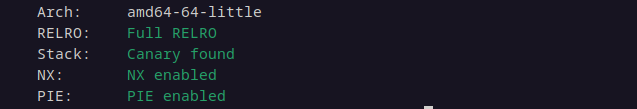
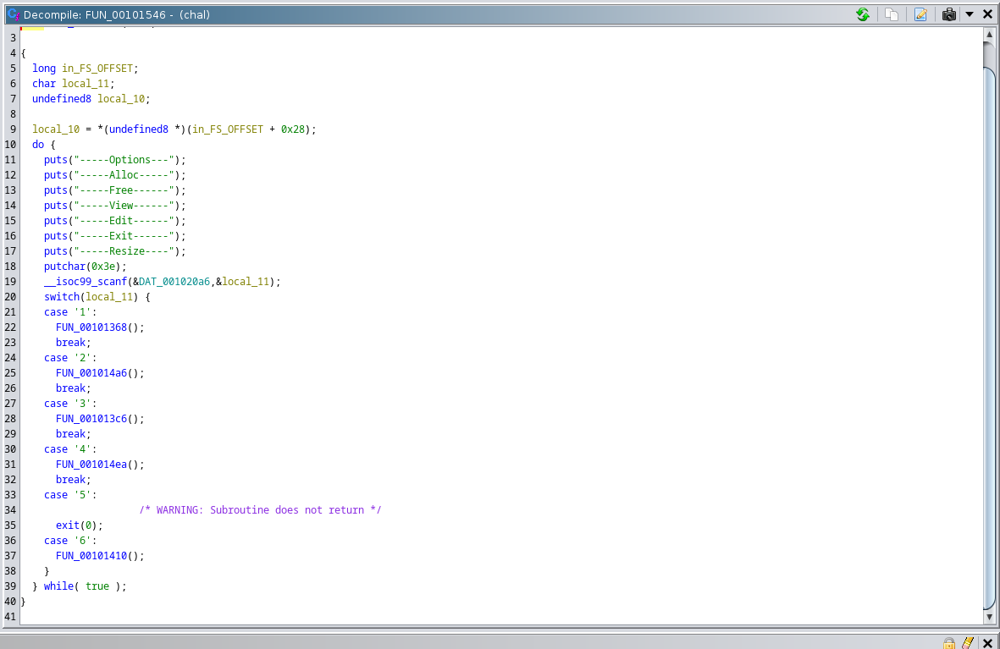
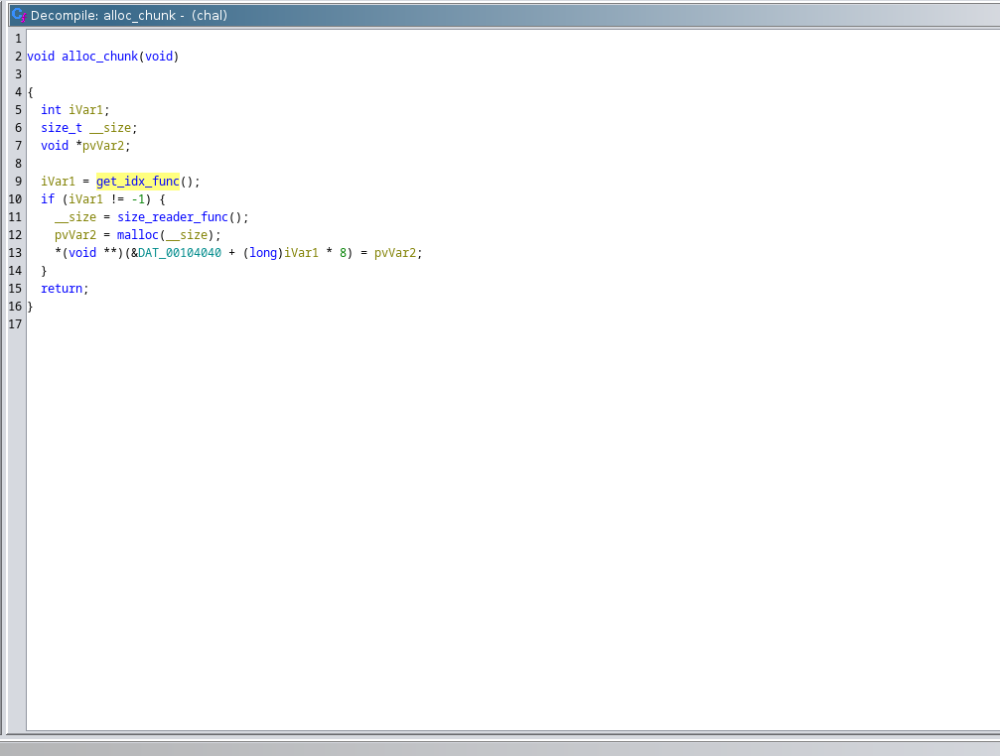
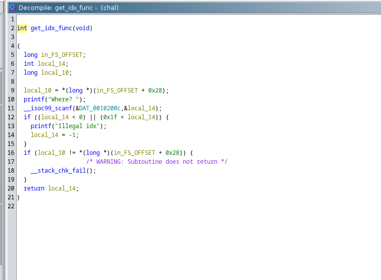
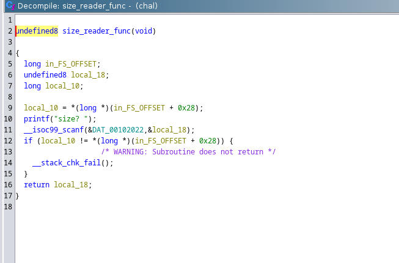
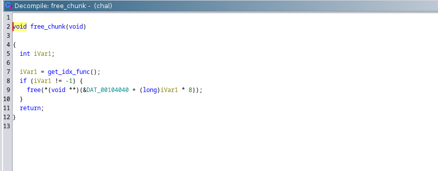
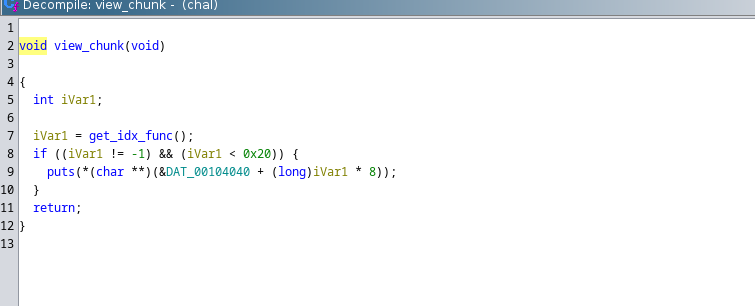
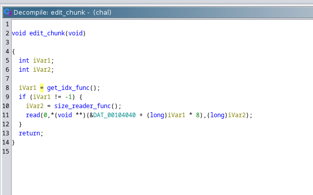
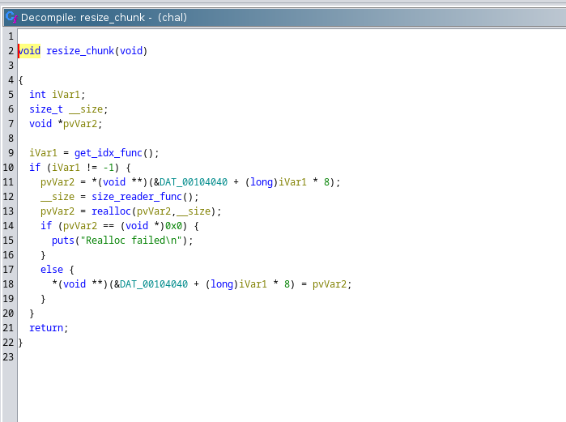

# Writeup for easy-note by tabuk

# First look
* Challenge is a standard 'heap-note'-type challenge. 
* Options are:
- 1: Allocate a 'note' with a given size
- 2: Free a note
- 3: View a note
- 4: Edit a note
- 5: Exit the program
- 6: Resize a note    
* With `checksec`, we see that the full set of standard glibc mitigations are enabled. 

# Reversing 
* In this writeup, I used ghidra because it's free, but you can use whatever you are most comfortable with. 

* Here is the disassembly for the menu function 

# Alloc
* Here's how chunk allocation is handled. Note that this 'chunk' is tracked in a global array

* Note that the `get_idx_func` (my choice to rename it) sanity checks to ensure that a negative index or OOB index won't work. 

* Size is handled with a `scanf` wrapper, this doesn't have any implications for the challenge. 

 
# Clear
* Sanity check to ensure the index is valid, then free the note if in range.

# View
* Just calls `puts` on a note. Sanity checked index, as usual. 

# Edit
* Using the familiar-by-now wrappers, takes a note, sanity checks the location, and then edits it with our input.

# Exit
* Simply a wrapper around `exit`, not necessarily intended to be a part of the solution.

# Realloc
* Sanity check the user-supplied index, then call `realloc` on it with whatever size is given.

 

### Vulns
* There are two major flaws in this challenge, with `edit` and `clear`. 
* `edit` doesn't check that the chunk we edit is able to handle the given size. This results in a heap overflow. 
* `clear` doesn't zero out the note, leading to a UaF.

### Exploitation strategy
* This challenge uses glibc version 2.27, so this allows multiple different solutions given the bugs present. This solution will be based the `house of force` technique. To get a libc leak, use the UaF bug on a chunk in the `unsorted` bin. 

* More detailed info on these techniques available [here](https://guyinatuxedo.github.io/41-house_of_force/house_force_exp/index.html) and [here](https://blog.infosectcbr.com.au/2019/09/linux-heap-unsorted-bin-libc-base-leak.html) 

* Overall strategy:
- Leak libc and heap
- Overwrite top chunk to very large size
- Allocate a pointer to `realloc_hook`
- Since the top chunk is _very_ large, calculate the distance from a certain chunk that will give us a pointer to `realloc_hook`
- Once malloc returns said pointer, overwrite it with system.
- Create a chunk containing the string `cat /flag.txt`. 
- Invoke `realloc` with the 'Resize' function in the menu. Supply an index pointing to the chunk from the prior step. 