# Writeup for medium-note by tabuk

### First look

* As with `easy-note`, the same set of glibc mitigations apply
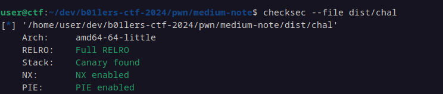

### Reversing
* All chunks are saved in a global array, same situation as `easy-note`
* `alloc`, `free`, and `view` are the same as in `easy-note`, so see the writeup for that challenge for more information.

### Edit 
* Here, we have the same wrapper functions and associated sanity checks seen in `easy-note`. 
However, the size isn't unrestricted. `malloc_usable_size` returns the size of the 'user data' section in a chunk. 

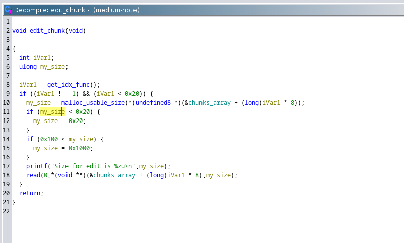

* The issue here is the 'rounding up' when the size is less than 0x20. The author 'assumed' that since 0x20 is the size of the smallest chunk malloc returns (on 64 bit), then the usable size shouldn't be less than that. This is wrong, of course. 

### ????
* When entering `7`, an address is leaked. This is a `win` function......if it can be called somehow.

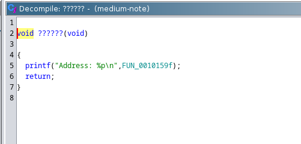

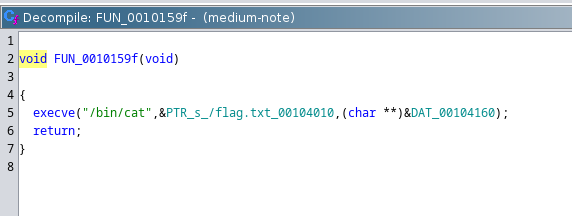

### Vulns
* Incorrect size check with `malloc_usable_size` gives an 8 byte overflow when inputted `size` < 0x20.
* UaF because `free` doesn't set the pointer to NULL.

### Exploitation strategy
* Allocate three chunks: A,B,C
- A,B,C,D are of size 0x18 (padded by malloc to 0x20).
- Overflow the `size` field of B to 0x41.
- Free the poisoned chunk `B` to make it go into the 0x40 tcache. This will give us large enough overflow to craft a fake chunk.
* Use UaF to leak heap address for tcache poisoning. Similarly, use unsorted bin trick to leak libc.
* Use libc leak to find address of the  `initial` libc variable, which points to exit handlers. See [here](https://m101.github.io/binholic/2017/05/20/notes-on-abusing-exit-handlers.html) for an outline of the next steps.
* Once ptr to this is returned, leak address of registered exit handler to leak the `secret`. 
* Use previous step to register our own fake exit handler that will execute the leaked 'win' function
* Trigger an `exit`
* ??? 
* Read flag

### detailed steps

#### Tcache poison
* Note that the addresses aren't consistent due to ASLR and the fact that I didn't do this all in one take. Your addresses will vary as well. 
* Take note of the heap layout after allocating 4 chunks: A,B,C,D
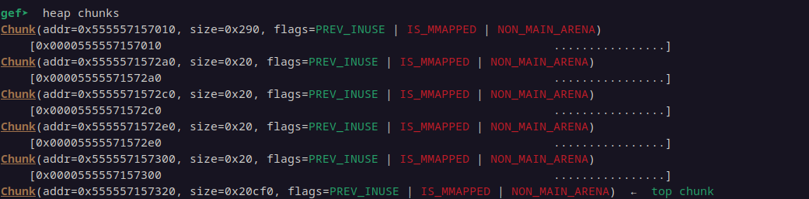
* Use the overflow to tweak the size of 'B' to 0x40 (really 0x41, but the 0x1 is for the `prev` bit). 
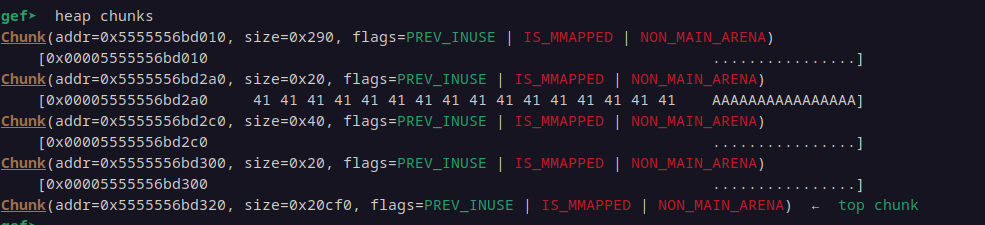

- Note that the 'C' chunk doesn't show up anymore. But in reality, B only appears to have 'swallowed' it (in `GEF`'s view) because its size goes past C's address entirely. 
 
* Next, let's free 'B' and 'D'
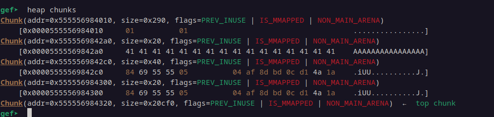

Observe that 'B' is not in the 'correct' tcache bin because we tweaked its size field.

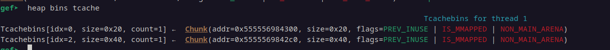 

* We need more data to do something with this situation, so we'll come back to it later. 
### Leaking the heap 
* Using our UaF bug, we can leak the heap by freeing a tcache chunk then reading from it. As long as we don't overwrite anything, there will be a heap address.  We have to shift left by 12 in order to get the actual address. In our case, this is the start of the heap.

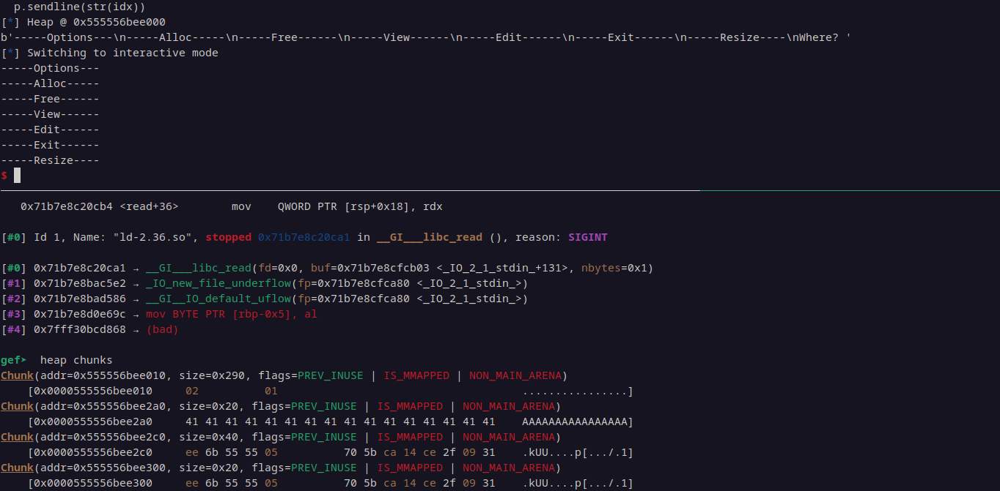

### Leaking libc
* The 'goal' of this step is to get a single chunk in the unsorted bin, then read from it. This will have a libc address on it, since our 'alloc' function doesn't zero out data that malloc returns. 
* However, [the tcache has priority over unsorted bin when satisfying malloc requests](https://sourceware.org/glibc/wiki/MallocInternals) . So, we need to groom a little bit to get to the 'goal'.
We will simply allocate 8 chunks of size 0x210 (0x200 usable) and free them. Since the tcache default size is 7, the most recently free'd  is going to land in the unsorted bin.
* We can ask for a chunk of a size (0x180) that the tcache bin 0x210 doesn't have, forcing it to go to the unsorted bin. It will split a chunk from what's available, which is a solo size 0x210 chunk. 

* Before filling `chunks[15]`
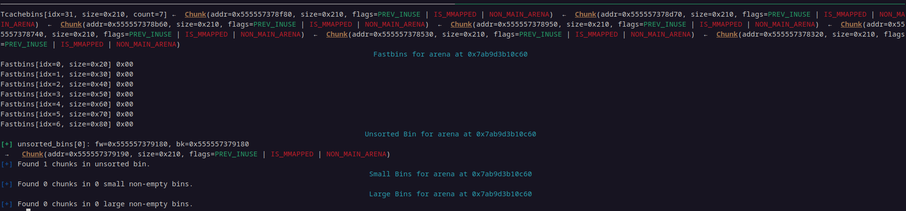

* After the `alloc(15,0x180)` call
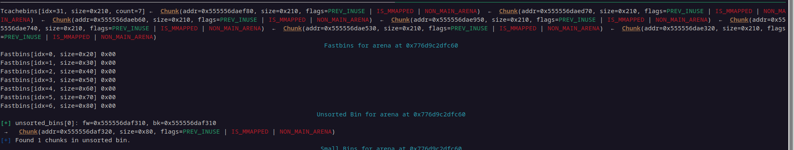

* Finding the libc base is simple math, as the libc file in use is given during the challenge.
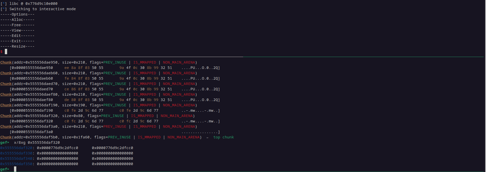

### Tcache poison pt 2
* Since we have a chunk that is really only 0x18, but is tagged with a size of 0x40 (0x38 usable), we have an overflow situation we can use to corrupt the next entry in the list.
* Since glibc 2.32, [there is a mechanism called safe-linking that ensures we can't trivially add a chunk to the tcache](https://lanph3re.blogspot.com/2020/08/blog-post.html)
* Using the leaks from the prior steps, we can bypass this by calculating a value that will pass the checks and return us a pointer to `initial`, which will have the corrupted exit handler.
* After the step `edit(4, len(value) + len(padding) , padding+value` in the exploit code, the tcache bin for 0x20 will look like this.

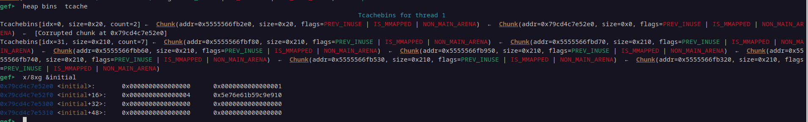

### End
* Next step is to leak the secret that's used in ptr mangling on the exit handler. A known handler is `_dl_fini`, which we can calculate from the libc leak. To do this, grab two chunks from the tcache. One 'throwaway', and the other will land at the start of `initial` (inserted in prior step). The layout of the exit handler is `0x1 | 0x1 | 0x4 | mangled pointer`, so just edit 0x18 bytes and read it to get the encoded value. Use the address of `_dl_fini` to find the secret.    

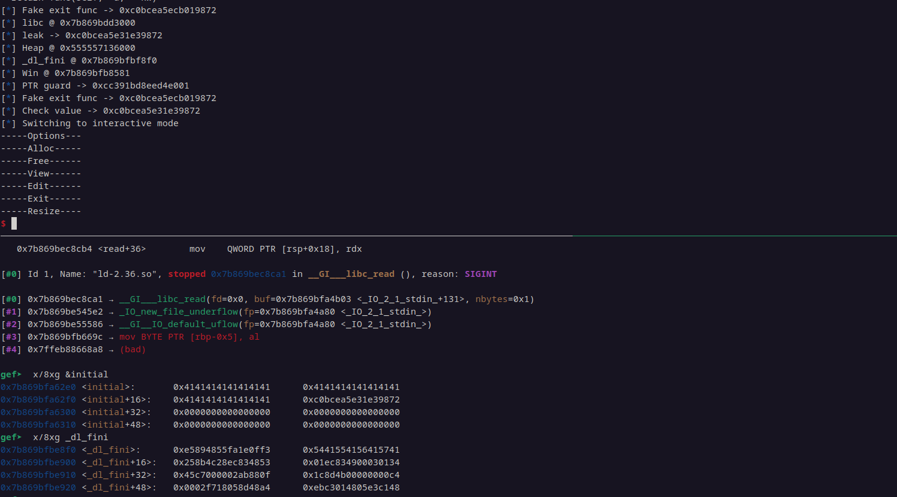

* Once we have the new exit handler calculated, we have to write the values 0x0, 0x1, and 0x4 back in the entry (see the link in `Exploitation strategy` on what these mean) plus the new value.
* Call exit
	- to avoid segfault in `dl_resolve` and elsewhere, fixup the corrupted tcache by allocating some fresh chunks and freeing them. 
* ???
* [heap 11](images/heap_11.png)

### Exploitation note
* Solution script may have to be rerun a dozen or so times in order to execute completely.